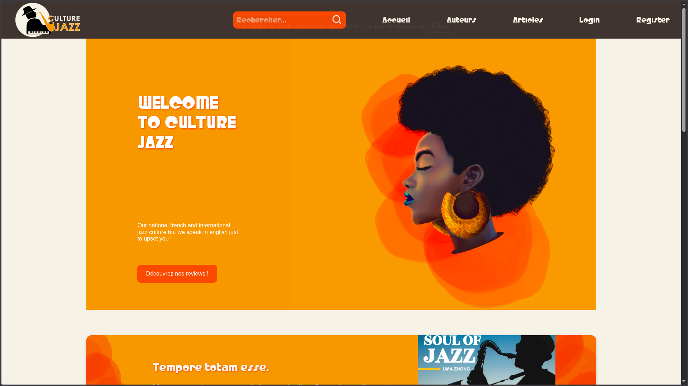

<p align="center">
    
</p>

# 🎷 Culture Jazz

**Culture Jazz** est une application web développée avec **Laravel (PHP)**, dédiée à la publication et au partage d’articles musicaux autour d’un style précis : le Jazz.
Le projet prend la forme d’un blog musical communautaire, où les utilisateurs peuvent publier, découvrir et interagir avec des articles à travers des critères musicaux originaux.

<p align="center">
    
</p>

## 🎓 Contexte du projet

Ce projet a été réalisé dans le cadre d’un projet de SAE (Situation d’Apprentissage et d’Évaluation) du troisième semestre de BUT Informatique et de BUT MMI.

Le contexte de ce projet a été spécial puisqu'il a été réalisé en 36h dans le cadre du 'Marathon du Web' organisé par le département informatique et le département MMI de l'IUT de Lens.

Le sujet consistait à concevoir une application web de blog musical, permettant aux utilisateurs de publier et consulter des articles autour d’un style musical défini : le Jazz.   
Les utilisateurs inscrits peuvent créer, modifier et publier leurs propres articles, tandis que les autres membres peuvent liker, commenter et suivre des auteurs.

## 🎯 Objectifs 

Les étudiants Informatique avait pour mission de développer la partie back-end de l'application en Laravel, en implémentant un maximum des fonctionnalités demandées. De leurs coté, les étudiants MMI se sont chargée de la conception de la charte graphique et des maquettes, ainsi que de l'intégration des fonctionnalités selon ces maquettes.

## Recupérer le projet

```bash
git clone https://github.com/Bryaan03/Culture-Jazz.git
cd Culture-Jazz
composer install
npm install
cp .env.example .env
php artisan key:generate
php artisan migrate
cp -r resources/images storage/app/public
php artisan storage:link
php artisan db:seed
npm run dev
# Dans un autre terminal
php artisan serve
```

## Languages et technologies utilisées

[](https://skillicons.dev)
